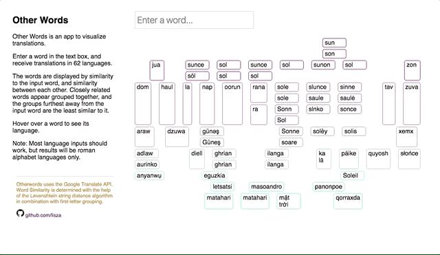

# Otherwords

### Overview
Other Words is an app to visualize translations and their relation to one another.
You enter a word and receive translations in 62 languages. The words are displayed by similarity to the input word, aa well as similarity between each other. Closely related words appear grouped together, and the groups furthest away from the input word are the least similar to it.

Note: Most language inputs work, but results will be roman alphabet only.



### Word similarity
Word similarity is determined by a combination of:
- Edit distance from input to translation. I use the Levenshtein string distance algorithm to calculate a distance for each translation.
https://en.wikipedia.org/wiki/Levenshtein_distance
- Between-translation similarity. First letter grouping turns out to provide a good approximation of likeness when used in combination with string distance.

### Visualization
Translations are visualized on a custom two dimensional plane.
- The spacial rendering of words on the page is based on the two similarity measures
(distance-from-input and between-word likeness).
- JavaScript dynamically generates HTML and CSS for the plane, and then
populates it with the asynchronously processed translation results.
- As a secondary means of visualization, border colors are also calculated based on similarity.

```javascript
const populateGrid = (results) => {
  Object.keys(results).forEach((key) => {
    let word = results[key];
    let parentId = `${word.distance}-${(word.letter)}`;
    let parentElement = document.getElementById(parentId);

    // Create new div for each word, append to parentId element
    if (parentElement) {
      let wordDiv = document.createElement('div');
      wordDiv.id = key;
      wordDiv.innerHTML = word.text;

      // Add tooltip span element inside of div
      let tooltip = document.createElement('span');
      tooltip.className = "tooltiptext";
      tooltip.innerHTML = word.language;
      wordDiv.appendChild(tooltip);

      // Calculate border color based on word distance
      wordDiv.style.border = `1px solid rgb(180, ${word.distance * 40}, 180)`;

      parentElement.appendChild(wordDiv);
    }
```

### Translate API
Otherwords uses the Google Translate API to fetch translations for more
than 60 languages at a time.
- API requests are batched for improved speed and streamlined handling of
asynchronous requests and promises.
- For the moment languages are confined to roman script, but with some care and knowledge of alphabets, non-roman scripts could be compared as well.
