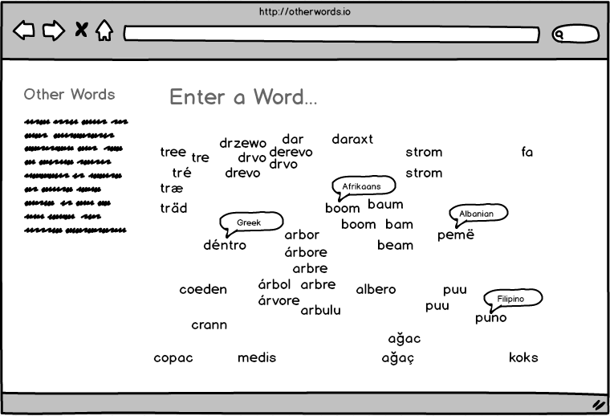

# Otherwords

## Background and Overview
Otherwords is a website that shows a word translated into different
languages all at once. Using the Google Translate API and an algorithm
to determine string similarity, a word and its translations are displayed on a
similarity continuum that will (ideally) visually highlight common
etymological roots.

## Functionality & MVP
In OtherWords, users will be able to:
- [ ] Provide a word to be translated via a textfield input
- [ ] The site will return a list of translations in different languages
(probably restricted to Roman alphabets for now)
- [ ] The translations will be displayed by similarity
- [ ] Hovering over a translation shows the language

## Wireframes


## Architecture and Technologies
- JavaScript
- Google Translate API, via npm package [google-translate-api](https://github.com/matheuss/google-translate-api)
- Levenshtein Distance algorithm to calculate string differences https://en.m.wikipedia.org/wiki/Levenshtein_distance, or possibly a
different string distance algorithm (Jaro-Winkler, or Dice coefficient).

## Implementation Timeline
__Over the weekend:__
- Researched and tested Google Translate API and a corresponding node
 package.
- Researched and tested different algorithms to compare strings.
- I couldn't get the node modules working on the site due to set up issues.
- DID NOT: Built a sample site with working translate API responses.
- DID NOT: Calculated string distances for each translation from the input word.

__Day 1:__ Get basic functionality of the site working.

- [ ] Get basic site set up, including correct node module imports using
 webpack.
- [ ] Make sure google-translate-api works.
- [ ] Make sure I get a string distance algorithm working.

__Day 2:__

- [ ] Think about display of translation output once I have a
 better idea how my string distance algorithm output is distributed.
- [ ] Optimize/update string distance output for suitable rendering.
- [ ] Look into dataviz libraries to use, or use Canvas.

__Day 3:__ Data viz and styling.

__Day 4:__ More data viz, styling, bug fixes, optimization.

## Bonus features
- Optimize algorithm to calculate similarity.
- See how I can support romanized versions of non-roman alphabets.

## Possible algorithms:
- Levenshtein distance node module https://www.npmjs.com/package/levenshtein
- Supports multiple algorithms: https://www.npmjs.com/package/natural#string-distance
- https://en.m.wikipedia.org/wiki/S%C3%B8rensen%E2%80%93Dice_coefficient ?
- Display results alphabetically in combination with an intersection count.
- Simple difference or intersection, e.g.

```javascript
function intersect(a, b) {
  return a.filter(Set.prototype.has, new Set(b));
}

let a = [ 'n', 'i', 'g', 'h', 't' ];
let b = [ 'n', 'a', 'c', 'h', 't' ];

intersect(a, b);
// [ 'n', 'h', 't' ]
```
